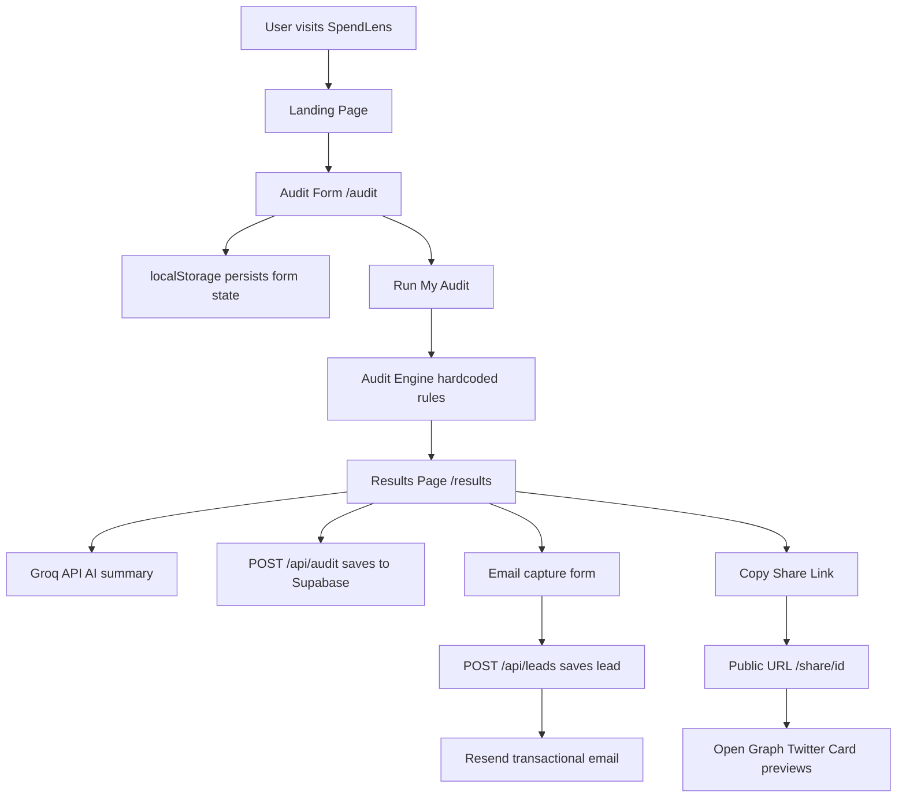

# Architecture

## System Diagram

## Data Flow

1. User fills audit form with AI tools, plans, seats, monthly spend
2. Form state saved to localStorage on every keystroke
3. On submit, audit input saved to localStorage as spendlens-audit
4. Results page reads from localStorage and runs audit engine
5. Audit engine applies hardcoded rules to generate recommendations
6. Results page calls Groq API for AI summary with fallback
7. Audit saved to Supabase audits table with unique UUID
8. Shareable URL generated as /share/uuid
9. User enters email — lead saved to Supabase leads table
10. Resend sends transactional confirmation email

## Why I chose this stack

**Next.js** — App Router gives us server components, API routes, and static generation in one framework. No need for a separate backend.

**TypeScript** — Enforces type safety across the audit engine, pricing data and API routes. Catches bugs at compile time not runtime.

**Tailwind CSS** — Utility-first CSS that lets us build a polished UI without writing custom CSS files. Fast to iterate.

**Supabase** — Postgres database with a simple JavaScript client. Free tier handles our scale. Row Level Security built in.

**Groq** — Free API access to Llama models. Faster and cheaper than OpenAI for a simple summarisation task.

**Resend** — Simple transactional email API with a generous free tier. Much easier to set up than SES.

**Vercel** — Zero config deployment for Next.js. Automatic preview deployments on every push.

## What I would change for 10k audits per day

1. **Add a job queue** — Move AI summary generation to a background job (BullMQ or Inngest) so results page loads instantly
2. **Cache audit results** — Redis cache for repeated audits with same inputs
3. **Database indexing** — Add indexes on audit_id and email columns in Supabase
4. **Rate limiting** — Add Redis-backed rate limiting on all API routes
5. **CDN for assets** — Move static assets to Cloudflare CDN
6. **Monitoring** — Add Sentry for error tracking and Posthog for analytics
7. **Horizontal scaling** — Vercel auto-scales but Supabase would need Pro plan