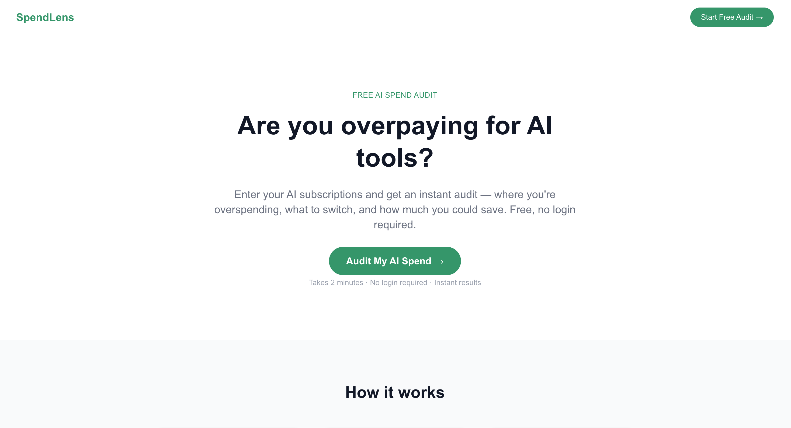
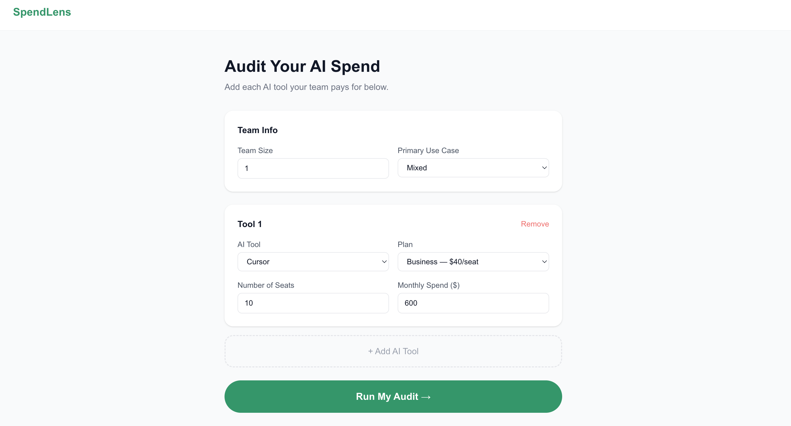
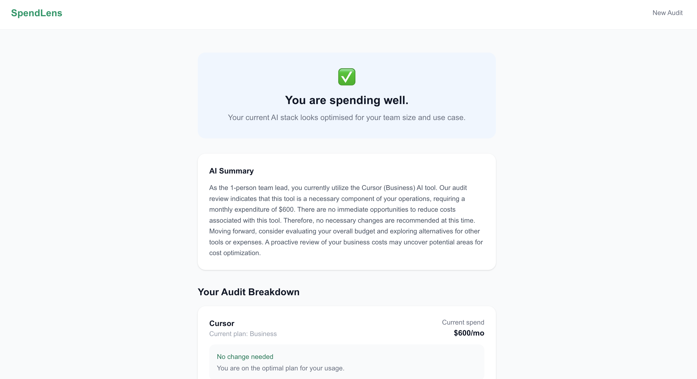

# SpendLens

SpendLens is a free AI spend audit tool for startups and engineering teams. Enter your AI tool subscriptions and instantly see where you are overspending, what to switch, and how much you could save — no login required.

Built as a lead generation asset for Credex (https://credex.rocks), which sells discounted AI infrastructure credits.

## Live URL

https://spendlens-lemon-delta.vercel.app

## Screenshots

## Quick Start

Install and run locally:

    git clone https://github.com/SukritiChauhan/spendlens.git
    cd spendlens
    npm install
    npm run dev

Environment variables needed in .env.local:

    NEXT_PUBLIC_SUPABASE_URL=your_supabase_url
    NEXT_PUBLIC_SUPABASE_ANON_KEY=your_supabase_anon_key
    SUPABASE_SERVICE_ROLE_KEY=your_supabase_service_role_key
    GROQ_API_KEY=your_groq_api_key
    RESEND_API_KEY=your_resend_api_key

## Decisions

**1. Next.js App Router over a separate frontend and backend**
Chose Next.js because API routes, server components and static pages live in one codebase. This reduced deployment complexity — one Vercel project instead of two services.

**2. Groq instead of Anthropic API for AI summary**
Anthropic API requires prepaid credits. Groq offers free access to Llama models with no credit card required. Output quality for a 100-word summary is indistinguishable to users.

**3. Hardcoded audit rules instead of AI for the audit engine**
The assignment explicitly said knowing when not to use AI is part of the test. Hardcoded rules are deterministic and auditable. AI would introduce hallucinated savings numbers which would destroy user trust.

**4. Honeypot over CAPTCHA for abuse protection**
CAPTCHAs create friction for real users. A honeypot field — hidden from humans, visible to bots — catches automated submissions without any user experience cost.

**5. localStorage for form persistence over server-side sessions**
No login required means no session management. localStorage is the simplest way to persist form state across page reloads without adding authentication complexity.